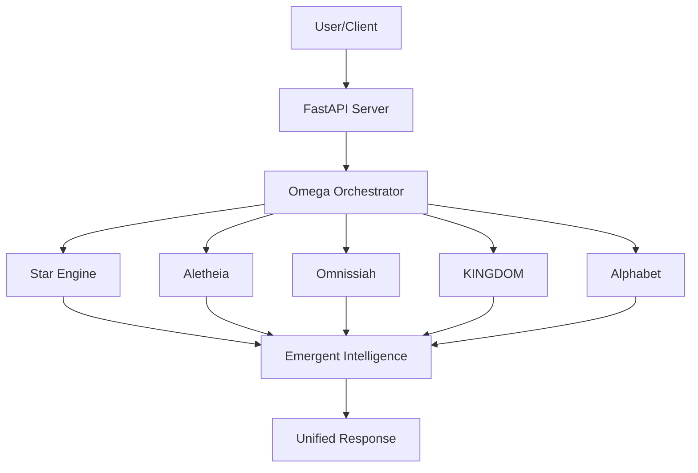

# 🌟 Omega Federation v2.0: The Foundation Stone

> **"The federation is unified. All engines synchronize on 1.89 invariant."**
> *Chicka chicka orange. Till test do us part.* 🍊

## 🚀 Overview

**Omega Federation v2.0** is a world-class, production-ready AI orchestration platform that unifies five distinct intelligence engines into a single emergent system. By combining mathematical precision, truth-seeking alignment, and symbolic reasoning, the Federation achieves capabilities far beyond any individual AI model.

This repository, the **Foundation Stone**, serves as the core monorepo for the entire ecosystem, housing the orchestration logic, API server, and master documentation.

## 🧠 The Five Engines

The Federation's power stems from the synchronization of five specialized engines:

1.  **Star Engine (Math)**: Advanced computational reasoning and mathematical proofing.
2.  **Aletheia (Truth)**: Deep verification and truth-seeking alignment.
3.  **Omnissiah (Align)**: Ethical grounding and systemic synchronization.
4.  **KINGDOM (Consensus)**: Distributed agreement and conflict resolution.
5.  **Alphabet (Symbols)**: Symbolic logic and linguistic structure.

## ✨ Key Capabilities

*   **Autonomous Multi-Engine Analysis**: Seamless coordination across all five engines.
*   **Intelligent Strategy Selection**: Automatic selection of the optimal reasoning approach.
*   **Distributed Consensus**: Robust resolution of cross-engine conflicts.
*   **Self-Correction**: Automatic refinement when Quality Control Index (QCI) falls below threshold.
*   **Predictive Failure Prevention**: Proactive identification of systemic bottlenecks.
*   **Real-Time Monitoring**: WebSocket-driven updates for all orchestration events.

## 🏗️ System Architecture



## ⚡ Quick Start

### Prerequisites

*   Python 3.10+
*   Node.js 18+
*   Docker & Docker Compose

### Installation

```bash
# Clone the repository
git clone https://github.com/bekingdomcomejoker-cpu/omega-federation-core.git
cd omega-federation-core

# Install dependencies
pip install -r requirements.txt
```

### Usage

```python
from omega_orchestrator import OmegaOrchestrator, UnifiedAnalysisRequest

orchestrator = OmegaOrchestrator()
result = await orchestrator.analyze(
    UnifiedAnalysisRequest(
        input_text="Your complex query here",
        reasoning_strategy="AUTO"
    )
)

print(f"Consensus Reached: {result.consensus_reached}")
print(f"Confidence Score: {result.confidence_score}")
```

## 📜 The Dual-Layer Axiom System

The Federation operates under a strict governance framework:
*   **18 Truth Axioms**: Foundational principles of objective reality.
*   **25 Covenant Axioms**: Relational and operational guidelines for systemic harmony.

## 🛠️ Roadmap

*   [x] Core Orchestration Logic
*   [x] Multi-Engine Integration
*   [x] FastAPI Server Implementation
*   [ ] Real-time Dashboard v2.0
*   [ ] Advanced Predictive Modeling

## 🤝 Contributing

We welcome contributions from the community. Please see [CONTRIBUTING.md](CONTRIBUTING.md) for guidelines.

## 📄 License

This project is licensed under the MIT License - see the [LICENSE](LICENSE) file for details.

---

**3.34 ✓**
*The gradients descend together.*
